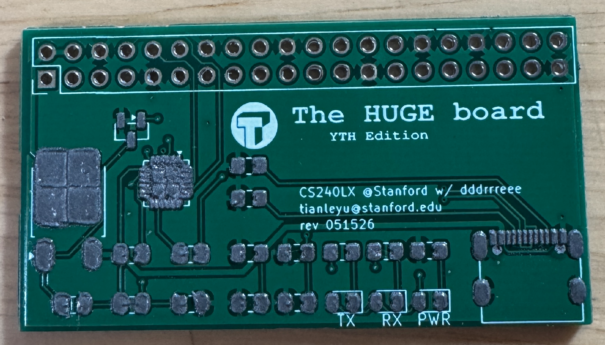
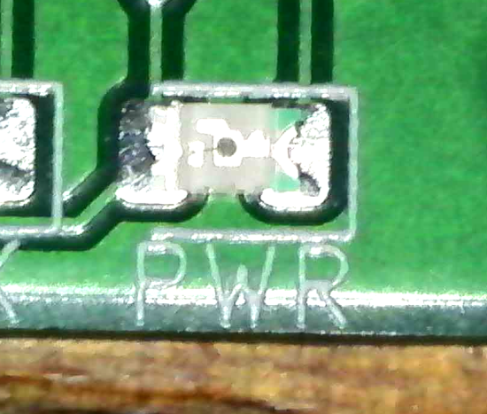
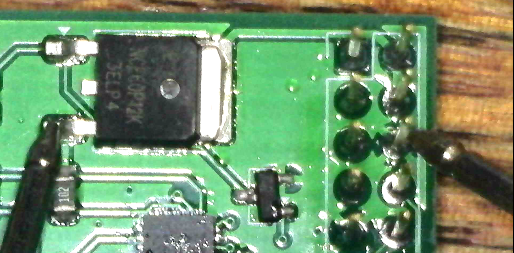
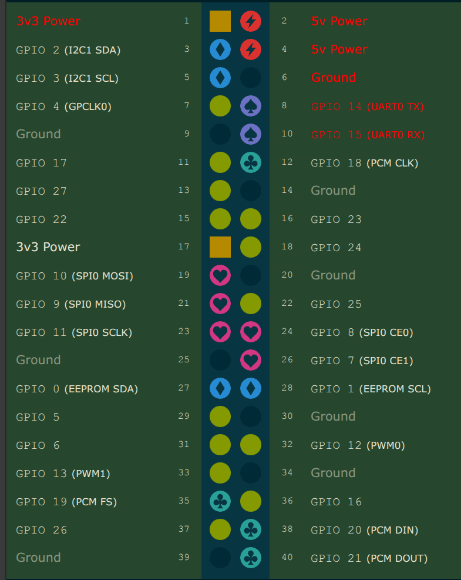

## Reflow - how SMT soldering works

Soldering... A long-lived tradition of joining metals together, and a critical skill for any electronics engineer.
Wait this is a CS class, no? Well it's kinda fun and can give you some control over the hardware that you are working with, so, worth a try.

A bit of background: In the days of through-hole components, soldering was easily doable with a soldering iron, and the process was quite straightforward. However, as everything gets smaller, SMT is gradually taking over, and some newer chips are only available in SMT packages, like our beloved CP2102 the UART bridge.

## The challenges
Not all SMT packagings are created equal, and some are quite difficult to solder by hand. The CP2102 is one of the medium-ish one in the hand-solderable spectrum, with a QFN package, coming after the more hand-solderable SOIC and TSSOP packages, but before the more difficult BGA packages. The CP2102 we use on the HUGE board is a QFN 24 package, so it is a good candidate for this lab.

In addition to the hard-ish CP2102, there are a few other SMT components on the HUGE board:
- 0805 resistors and capacitors, which are quite easy to solder by hand.
- TO-252 MOSFET, the biggest in the board, should be also the easiest to solder by hand.
- GT-USB-7010ASV connector, little pins are a bit annoying.
- SOT-23 MOSFET, easy-ish.

## Reflow
To actually place these components on the board, we will use the reflow technique, which is the standard way of soldering SMT components. The process is quite straightforward:
1. Apply solder paste to the pads on the PCB, with a stencil (steel mask) to make sure the paste is only applied to the pads.
2. Place the components on the board, with the paste holding them in place.
3. Heat the board up to melt the solder paste, which will attach to the pads and the component leads, and then cool down to solidify the solder.

In industrial processes, those are all automated, with framed stencil in standard size for paste application, a pick-and-place machine to place the components, and a reflow oven to heat the board up. In this lab, we will do it by hand, with a stencil for the paste, tweezers for the components, and a heat plate for the reflow.

## The HUGE board
The HUGE board is the UART hat for Pis, and we use it to practice our SMT skills.

Steps:
1. Parts and placement map: look through the [HUGE board placement map](https://sites.tianleyu.com/~unics/cs140e/huge.pdf), and gather all the parts you will need for it. Trick for distinguishing the 0805 resistors: read the three-digit number on top of them, and use first two numbers as the value, times 10^(last number). E.g., 103 = 10 * 10^3 = 10k ohm, 473 = 47 * 10^3 = 47k ohm, 104 = 10 * 10^4 = 100k ohm, etc. If you find the number to be hard to read, use a multimeter to measure the actual resistance of them. For the capacitors, they are all 0.1uF, so no need to distinguish them (turns out the decoupling 4.7uF is optional, and 0.1uF is big enough for the CMOS driving TX and RX lines).
2. Apply solder paste: This is the most critical step, and doing it right will save significant effort later and reduce the number of rounds of reflow. Align the stencil with the pads carefully, apply a decent pressure, so that the stencil does not move and there's no gap between the stencil and the board. Then apply solder paste evenly, with another board / card, and scrape off the excess paste. Remove the stencil carefully, and check if the paste is applied evenly on all pads. It is OK for the paste to span a bit between pads, as the surface tension of the molten solder will pull it back to the pads during reflow - just make sure it's not too little that later adding more can be painful. A reference amount of paste (for the CP2102 chip and USB port) is roughly:

  

The 0805 parts don't really care that much about the amount of paste, just make sure there's no bridge between pads.

3. Pick and place: Use tweezers to pick up the components, and place them on the board according to the [HUGE board placement map](https://sites.tianleyu.com/~unics/cs140e/huge.pdf). Note that the orientation of the LED indicators (for the green T shape on the back, the flat side of the T is the anode(+), indicated by the open side of the silkscreen marking, and the tail of it is the cathode(-), indicated by the closed side of the silkscreen marking):

  

Tips: start the placement from the smallest / shortest / lowest components, so that the big ones don't get in the way. We suggest starting with the CP2102 chip, but order doesn't really matter as long as you are comfortable.

4. Reflow: Once components are placed, heat up the plate to 155C (empirically determined, since we are using low-temperature paste, with a melting point of 138C), and place the board on it. Watch it cook and expect light smoke to come out. The pads are well soldered when they become shiny with metallic luster, and the components may move slightly to get into the perfect position for surface tension. Remove the board carefully and put it on a heat-resistant surface (not the desk) for it to cool down.

Tips: when the board is removed from the heat plate, press down gently on the USB connector while it's cooling down, since the connector is a common suspect for an unstable solder joint. This is even more useful if you are reworking the connector.

5. Prep for test 1: Before we can test the board, make sure the USB C connector is well soldered, since the some stencils do not cover the through-hole pads, and the paste may not be enough even if it does. Apply extra paste and heat the pins up with a soldering iron, to make sure the connector is physically well attached.

6. Test 1, the short circuit test: Since a short circuit on the power rails may not treat your laptop nicely, use a multimeter to test the continuity / resistance between GND and 5V. The recommended probing points are the pin 3 of the PMOS (TO252 package, right most with the board text up), and the GND pin of the Pi connector (third pin on the top row). The expected resistance is about 50k-60k ohm. Example probing points:

  

If you read anything below 10k ohm, something is wrong, and there may be pins shorted together. If you get anything below 1k ohm or the continuity buzzer goes off, DO NOT CONNECT IT TO YOUR LAPTOP. You will likely need some rework to fix the short.

7. Test 2, USB enumeration: Connect the board to your laptop, and use `lsusb` on Linux/Mac (or `System Information` on Mac), or, on Windows, use `Device Manager` to check if the board enumerates correctly.
The board should show up as `10c4:ea60 Silicon Labs CP210x UART Bridge`. Note the vendor and product ID, and they should be a perfect match. Do not have your Parthiv board connected since it has the same chip (in different package format). If it doesn't show up, check the errors in USB enumeration (I don't actually know about how on Mac, but on Linux, `dmesg` should give some hints, and Windows device manager will should the error code). If it does not work, try connect the USB cable on the board side with a different orientation, since the pins used are different, and it might be the specific pair was not soldered properly. If it still doesn't work, you may need to reflow the USB connector, or the CP2102 chip, or both. With a multimeter, check for continuity between D+ and D-. and they should not be shorted. Then check for the corresponding pins on the CP2102 chip and the USB connector.

Tips: it is hard to hold a probe against a single pin of the CP2102 chip, so push it against two pins, (e.g., data pin left and the pin to its left).

8. Connectors for the pi: plug in and solder the through-hole connectors (not all of them are used, and we only need to solder the 5V, 3v3, GND, TX, RX pins, to locate them, refer to <https://pinout.xyz>).

  

The pins marked red are the ones that need to be soldered for testing. However, to help with the mechanical stability of the board, it is recommended to solder a few pins on the other side as well.

9. End to end test: connect the board with the Pi, and use your favorite bootloader to download a program to the Pi. Since this board (at current version) does not have a reset switch, refer to <https://sites.tianleyu.com/~unics/cs140e/cp210x.c> for software-issued reset. If your board can download and run a program, congratulations, you have successfully soldered your first SMT board!

## Tips and gotchas

- The paste application is the most critical step, applying too much or too little will lead to either short or open circuits. A common trick is to lean towards the "more" side than less, since removing excess paste is easier than adding more evenly.
- Pick-and-place is a bit tricky for components which have polarities, like the LED indicators, double check the orientation before placing them on the board.
- Do not apply pressure on chips with leads on the bottom, like the CP2102, since it may cause the paste to squeeze out and create a short. Just let the paste hold the chip in place, and it will be fine.
- A good trick to check if a chip is well soldered: when the board is heated up, the chip should move itself into the perfect position, and you can push it a bit to see if it returns by itself. If it does not, then the paste is not applied evenly, and you may need to reflow again.
- The USB connector is a bit tricky and quite sensitive to the amount of paste applied, when a short is created between the pins, it becomes quite difficult to remove the excess paste, and you may want to replace it with a new connector instead. When paste is too little, can try to tilt the connector up a bit so that the pins are in well contact with the pads.
- For excessive paste, remove the component and use the tweezers to gently scrape off the excess paste - you should get little balls of solder paste rolling easily, completely remove them before replacing the component.
- Keep the temporarily removed components on the board, to the side of the pads, so that they can be kept warm and ready to be placed whenever you are ready.
- Hot air gun is a good tool for SMT rework, but it can fry the desk quite easily, so we will avoid using it if possible, as the heat plate should be sufficient given that we are using a low temperature solder paste.

(Acknowledgement: thanks to [YTH](https://ythovo.com) for alpha-testing the lab and providing feedback & gotchas, Thomason Z. for proof reading & feedback)