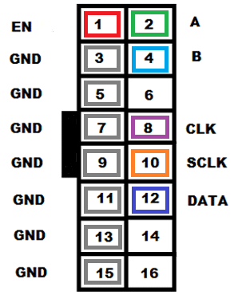
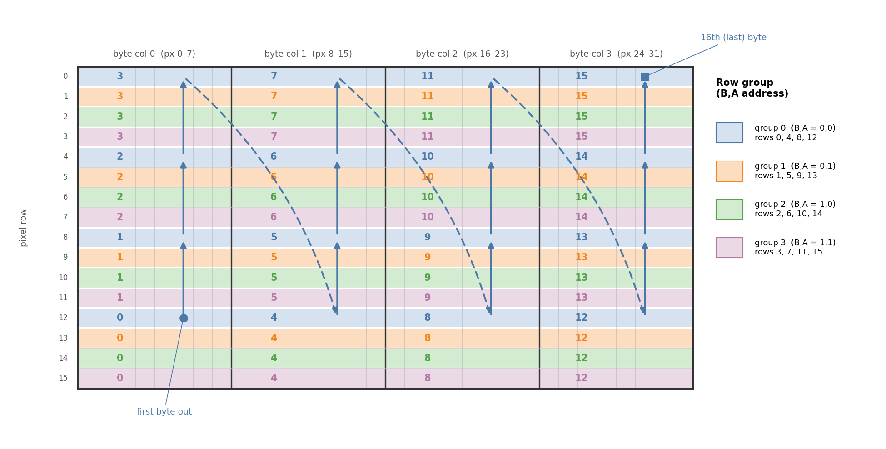

## P10 LED

Have you ever wanted to drive some big LED displays? Like these installed on the side of buildings in Times Square:

  

<!-- (image credit: https://newyorkyimby.com/2019/05/one-times-squares-300-foot-long-led-screen-nearly-assembled-in-times-square.html) -->

Well that's a bit too fancy, but it turns out the mono color version of these LED screens are actually just a bunch of shift registers! So should be quite easy to drive with our Pi (question mark?).

In this lab, we will explore how the cheapest, easiest, P10 LED display units work, how to abuse the hardware to make a fast driver for it, and how to chain them together to make a larger display. Colored displays are a bit more complicated, but could be a nice extension.

## Physical layout
The name P10, stands for "10mm pitch", which is the distance between the centers of two adjacent LEDs. The display is made up of a grid of 32x16 LEDs. Multiple panels can be daisy chained together to make a larger display.

## Signaling
These LED panels have two 2x8 pin headers, on each side of the panel.
These headers are directional (look for arrows on the PCB), so the Pi input should go into the tail of the arrow, and the output should come out of the head of the arrow. The pinout of these connectors is as follows:

  

(img credit: https://bestengineeringprojects.com/interfacing-p10-led-display-with-arduino/)

A bit of explanation of the signals:
- **EN**: Global enable, active high. This is THE switch that turns on the display, which you can also use for PWM dimming.
- **A, B**: Row select lines. These lines select which group of the interlaced rows to drive. More details on this below.
- **CLK**: Clock line. This is the clock for the shift registers to move one bit of the data, on the rising edge.
- **SCLK**: The latch clock line. This is the clock for the shift registers to latch the data into the output register, on the rising edge.
- **DATA**: The data line. This is the serial data input for the shift registers.

One thing to note is the electronic properties of the panel. All of these digital signals expect 5V actively driven signals, which in ideal cases should be handled by a level shifter. However, the Pi's GPIO pins are 3.3V, which is above the logic threshold for the panel, and empirically experimented to work fine, but may become a blocker if you try to drive it very quickly or over long wires since parasitic capacitance may cause the signal to degrade. For the purposes of this lab, we will ignore this issue, but if you want to make a more robust driver, you should consider using a level shifter. With this said, the through output of the panel is re-driven to 5V, which is good for chaining but also means you should never connect the Pi directly to the output of the panel, as it will fry your Pi.

**Common gotcha**: Some of these boards have a protection mechanism, that only allows driving the lights for a short (~0.1 second) period of time, and automatically turns off after a bit. If you are trying with some static PoC, make sure to blink the display periodically so that you can see the output.

## Scan pattern
One of the most important things to understand about these displays is how they are scanned. Unlike the classic I/P style (e.g., 720p/1080i) scanning on screens, the scan pattern of these boards gets quite complicated, and since there's no unified standard, different manufacturers tend to invent different scan patterns. It will be a good exercise to figure out the scan pattern of your board, but since it's mainly busy work, just use the following one that's been empirically determined to work for the boards we have.

  

(image credit: Tianle's notes + Claude)

## Driving the display
With the scan pattern in mind, we can now figure out what goes on the wire. To summarize it, driving the display involves:
- Setting address lines A and B to select the row group to drive.
- Shifting data for the selected row group into the shift registers, one bit at a time, using the CLK line.
- Latching the data into the output register using the SCLK line.
- Enabling the display using the EN line for a short period of time, to display the data.

But due to the grouping of the rows, this actually only drives 1/4 of the entire display, in disjoint lines...

So the intended driving logic is to rapidly cycle through the row groups, and for each group, shift in the data for that group, latch it, and enable the display. This rapid cycling creates the illusion of a fully lit display to the human eye, but also keeps the CPU in a busy loop.

## Exploiting the hardware
An easy trick is just to use the Pi's SPI peripheral to drive the CLK and SCLK lines, which is much faster than bit-banging. Try offloading the data shifting to the SPI peripheral, and use DMA to feed it, so that the CPU can do other stuff as one row group is on the fly. (common gotcha here: SPI does TX and RX at the same time, and we are not using the RX at all, but the fifo fills and the hardware may just stall. Drain the RX fifo as well to avoid this.)
However, you will still need to manually toggle the A/B, latch, and enable lines, which will still require the CPU to come back periodically.

To take this a step further, we can abuse the Pi's DMA engine (since they are Turing-complete), to handle all of that for us. With the infrastructure from the DMA lab from 240lx, this should be rather straightforward.

(Note: the core spirit of this lab is actually the single line above, and the rest is kinda busy work...)

## Final deliverable & extensions
The final deliverable of this lab is a driver that can drive the P10 display, and can bang out from a framebuffer with **zero CPU intervention**. The work on the CPU side is then very straightforward: fill the framebuffer according to the scan pattern, and the DMA engine will take it from there.

- **More is more**: make a larger display by chaining multiple panels together, and parameterize the driver to handle different configurations.
- **Colorful**: colored P10 displays are a bit more complicated, and the SPI trick may not work. Should still be doable with only DMA blocks.
- **Dimming**: implement PWM dimming by varying the duty cycle of the EN line.
- ... more ideas?